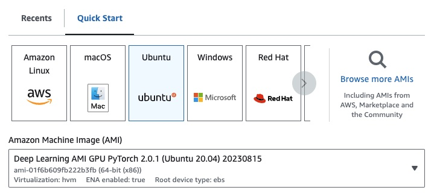

# 🎏 pykoi: RLHF/RLAIF in one unified interface
<p align="center">
  <a href="/LICENSE"></a>
  <a href="https://pypi.org/project/pykoi"></a>
  <a href="https://github.com/cambioml/pykoi/graphs/commit-activity"></a>
  <a href="https://join.slack.com/t/cambiomlworkspace/shared_invite/zt-1zes33rmt-20Rag043uvExUaUdvt5_xQ"></a>
</p>

[pykoi](https://www.cambioml.com/pykoi/) is an open-source python library for improving LLMs with RLHF. We provide a unified interface including RLHF/RLAIF data and feedback collection, finetuning with reinforcement learning and reward modeling, and LLM comparisons. 

## Features

`pykoi` let you easily get real-time user feedback and continuously improve your models. Here are some common applications:

### Sharable UI

Do you want to store your chat history with LLMs from OpenAI, Amazon Bedrock(:woman_technologist: building now :man_technologist:), or Huggingface? With just three lines of code, pykoi lets you to store them locally, ensuring 100% privacy. This includes launching a chatbot UI, automatically saving your chat history in your compute instance (cpu or gpu), and visualizing it on a dashboard. Explore the demos below:

- If you're using a CPU instance, check out [demo_launch_app_cpu.ipynb](https://nbviewer.org/github/CambioML/pykoi/blob/main/example/chatbot/demo_launch_app_cpu_openai.ipynb)
- If you're using a GPU instance, check out [demo_launch_app_gpu.ipynb](https://nbviewer.org/github/CambioML/pykoi/blob/main/example/chatbot/demo_launch_app_gpu_huggingface.ipynb)
- Alternatively, read our [blog](https://www.cambioml.com/docs/data_collection_feedback.html) for more information!


### Model comparison

Comparing models is a difficult task. `pykoi` makes it easy by allowing one to directly compare the performance of multiple models to each other, with just a few lines of code. If you have multiple language models that you’d like to compare to each other on a set of prompts or via an interactive session, you can use `pk.Compare`. Check out any of the demo below: 

- If you're using a CPU instance, check out [demo_launch_app_cpu.ipynb](https://nbviewer.org/github/CambioML/pykoi/blob/main/example/chatbot/demo_model_comparator_openai.ipynb)
- If you're using a GPU instance, check out [demo_launch_app_gpu.ipynb](https://nbviewer.org/github/CambioML/pykoi/blob/main/example/chatbot/demo_model_comparator_gpu_huggingface.ipynb)
- Alternatively, read our [blog](https://www.cambioml.com/docs/model_comparison.html) for more information!
 
 

### RLHF

Reinforcement Learning with Human Feedback (RLHF) is a unique training paradigm that blends reinforcement learning with human-in-the-loop training. The central idea is to use human evaluative feedback to refine a model's decision-making ability and guide the learning process towards desired outcomes. Researchers from [Deepmind](https://www.deepmind.com/blog/learning-through-human-feedback), [OpenAI](https://openai.com/research/learning-from-human-preferences) and [Meta Llama2](https://arxiv.org/pdf/2307.09288.pdf) have all demonstrated that RLHF is a game changer for large language models (LLMs) training.

`pykoi` allows you to easily fine-tune your model on the datasets you've collected via your `pykoi` chat or rank databases. Check our [blog](https://www.cambioml.com/docs/rlhf.html) for detailed instructions on how to use it.


## Installation
To get started with pykoi, you can choose from any of the installation options. The choice should be based on the features you need (e.g., RAG, RLHF or all) and the compute resources you have, such as a CPU (e.g., your laptop) or GPU (e.g., AWS EC2 or SageMaker).

### Option 1: RAG (CPU)
This option allows you to run RAG on a CPU using either the OpenAI API or the Anthropic Claude2 API. Installation of RAG (CPU) is simple if you have conda. If not, install [conda](https://docs.conda.io/projects/conda/en/latest/user-guide/install/index.html) for your operating system.

First, create a conda environment on your terminal using:
```
conda create -n pykoi python=3.10 -y
conda activate pykoi  # some OS requires `source activate pykoi`
```

Then install `pykoi` and the compatible [pytorch based on your os](https://pytorch.org/get-started/locally/)
```
pip3 install "pykoi[rag]"
pip3 install torch 
```

### Option 2: RAG (GPU) 
This option allows you to run RAG on a GPU using an open-source LLM from HuggingFace. Here's a quick [tutorial](#ec2-dev-setup) on setting up an EC2 GPU instance for the installation below.

On your GPU instance terminal, create a conda environment using:
```
conda create -n pykoi python=3.10 -y && source activate pykoi
```

Then install `pykoi` and [pytorch based on your cuda version](https://pytorch.org/get-started/locally/). You can find your CUDA version via `nvcc -V`.
```
pip3 install "pykoi[rag, huggingface]"

pip3 install --pre torch --index-url https://download.pytorch.org/whl/nightly/cu121  # cu121 means cuda 12.1
```

### Option 3: RLHF (GPU) 
This option allows you to train LLM via RLHF on a GPU. Here's a quick [tutorial](#ec2-dev-setup) on setting up an EC2 GPU instance for the installation below.

On your GPU instance terminal, create a conda environment using:
```
conda create -n pykoi python=3.10 -y && source activate pykoi
```

Then install `pykoi` and [pytorch based on your cuda version](https://pytorch.org/get-started/locally/). You can find your CUDA version via `nvcc -V`.
```
pip3 install "pykoi[rlhf]"

pip3 install --pre torch --index-url https://download.pytorch.org/whl/nightly/cu121  # cu121 means cuda 12.1
```

Congrats you have finished the installation! 

## Dev Setup
If you are interested to contribute to us, here are the preliminary development setup.

### Backend Dev Setup
```
conda create -n pykoi python=3.10
conda activate pykoi
cd pykoi
pip3 install poetry
```

Then, based the feature you need to develop, run one or more installation options below. We recommend install all the options below although it may take ~3 minutes longer.

- Option 1: RAG (CPU) 
  ```
  poetry install --no-root --extras rag
  ```
- Option 2: RAG (GPU) 
  ```
  poetry install --no-root --extras "rag huggingface"
  ```
- Option 3: RLHF (GPU) 
  ```
  poetry install --no-root --extras rlhf
  ```

Finally, if you are on a GPU, install [pytorch based on your cuda version](https://pytorch.org/get-started/locally/). You can find your CUDA version via `nvcc -V`.
```
pip3 install --pre torch --index-url https://download.pytorch.org/whl/nightly/cu121  # cu121 means cuda 12.1
```


### Frontend Dev Setup
```
cd pykoi/pykoi/frontend
npm install
npm run build
```

### EC2 Dev Setup
If you are on EC2, you can launch a GPU instance with the following config:
- EC2 `g4dn.xlarge` (if you want to run a pretrained LLM with 7B parameters)
- Deep Learning AMI PyTorch GPU 2.0.1 (Ubuntu 20.04)
    
- EBS: at least 100G
    

