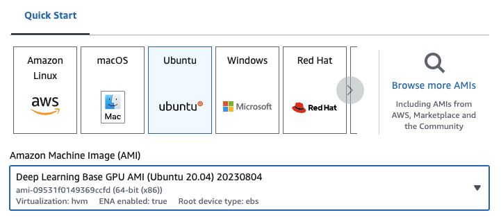
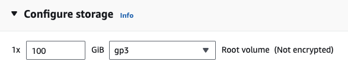

# 🎏 pykoi: Active learning in one unified interface

[pykoi](https://www.cambioml.com/pykoi/) is an open-source python library for LLMs providing a unified interface for data & feedback collection, RLHF, and model comparisons.

## Installation
To get started with `pykoi`, you can choose to one of following compute options: CPU (e.g. your laptop) or GPU (e.g. EC2).

### Option 1: CPU (e.g. your laptop)
Installation on a CPU is simple if you have conda. If not, install [conda](https://docs.conda.io/projects/conda/en/latest/user-guide/install/index.html) for your operating system.

First, create a conda environment on your terminal using:
```
conda create -n pykoi python=3.10 -y
source activate pykoi
```

Then install `pykoi` and the compatible torch version.
```
pip3 install pykoi
pip3 install torch
```

### Option 2:  GPU (e.g. EC2)

If you are on EC2, you can launch a GPU instance with the following config:
- EC2 `g4dn.xlarge` (if you want to run a pretrained model with 7B parameters)
- Deep Learning Base GPU AMI
    
- EBS: at least 100G
    

Next, on your GPU instance terminal, create a conda environment using:
```
conda create -n pykoi python=3.10 -y && source activate pykoi
```

Then install `pykoi` and the correlated torch version.
```
pip3 install pykoi && pip3 install torch --index-url https://download.pytorch.org/whl/cu118
```


Congrats you have finished installation, 

## How do I use `pykoi`?

`pykoi` is a python interface to unify your ML model development and production. You can easily get real-time user feedback and continuously improve your model.

Here are some common applications:

### Sharable Chatbot UI with Database

Are you concerned about storing your chat history with chatbots from OpenAI, Amazon Bedrock(:woman_technologist: building now :man_technologist:), or Huggingface? With just three lines of code, we enable you to store it locally, ensuring 100% privacy. This includes launching a chatbot UI, automatically saving your chat history, and visualizing it on a dashboard. Explore the demos below:

- If you're using a CPU instance, check out [demo_launch_app_api.ipynb](https://nbviewer.org/github/CambioML/pykoi/blob/main/example/chatbot/demo_launch_app_api.ipynb)
- If you're using a GPU instance, check out [demo_launch_app_gpu.ipynb](https://nbviewer.org/github/CambioML/pykoi/blob/main/example/chatbot/demo_launch_app_gpu.ipynb)
- Alternatively, read our [blog](https://www.cambioml.com/docs/data_collection_feedback.html) for more information!

### Model comparison

Comparing models is a difficult task. `pykoi` makes it easy by allowing one to directly compare the performance of multiple models to each other, with just 1 line of code. If you have multiple language models that you’d like to compare to each other on a set of prompts or via an interactive session, you can use `pk.Compare`. Check out any of the demo below: 

- If you're using a CPU instance, check out [demo_launch_app_api.ipynb](https://nbviewer.org/github/CambioML/pykoi/blob/main/example/chatbot/demo_model_comparator_openai.ipynb)
- If you're using a GPU instance, check out [demo_launch_app_gpu.ipynb](https://nbviewer.org/github/CambioML/pykoi/blob/main/example/chatbot/demo_model_comparator_hf.ipynb)
- Alternatively, read our [blog](https://www.cambioml.com/docs/model_comparison.html) for more information!
 
### RLHF

Reinforcement Learning with Human Feedback (RLHF) is a unique training paradigm that blends reinforcement learning with human-in-the-loop training. The central idea is to use human evaluative feedback to refine a model's decision-making ability and guide the learning process towards desired outcomes. Researchers from [Deepmind](https://www.deepmind.com/blog/learning-through-human-feedback), [OpenAI](https://openai.com/research/learning-from-human-preferences) and [Meta Llama2](https://arxiv.org/pdf/2307.09288.pdf) have all demonstrated that RLHF is a game changer for large language models (LLMs) training.

`pykoi` allows you to easily fine-tune your model on the datasets you've collected via your `pykoi` chat or rank databases. Check our [blog](https://www.cambioml.com/docs/rlhf.html) for detailed instructions on how to use it.


## Dev Setup
If you are interested to contribute to us, here are the preliminary development setup.

### Backend Dev Setup
```
conda create -n pykoi python=3.10
conda activate pykoi
cd pykoi
pip3 install poetry
poetry install --no-root
```

### Frontend Dev Setup
Frontend:
```
cd frontend
npm install vite
npm run build
```
