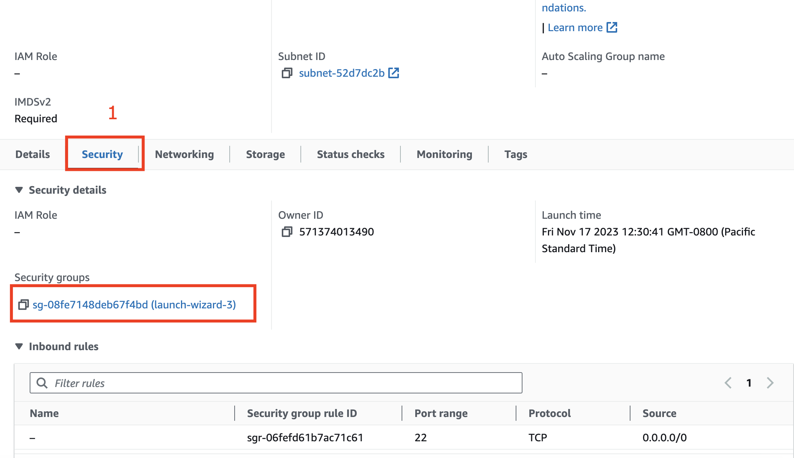
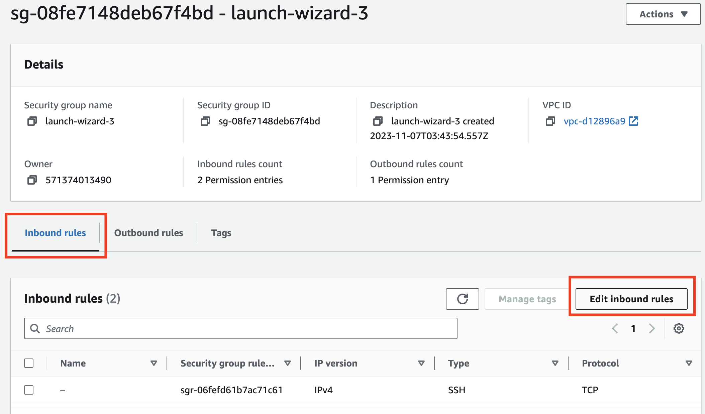
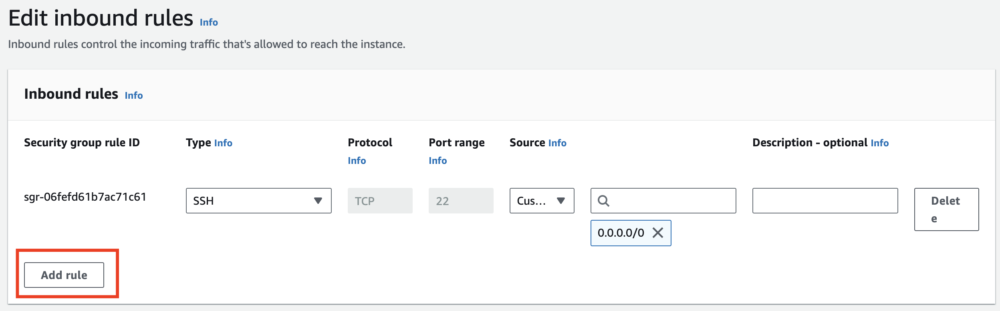
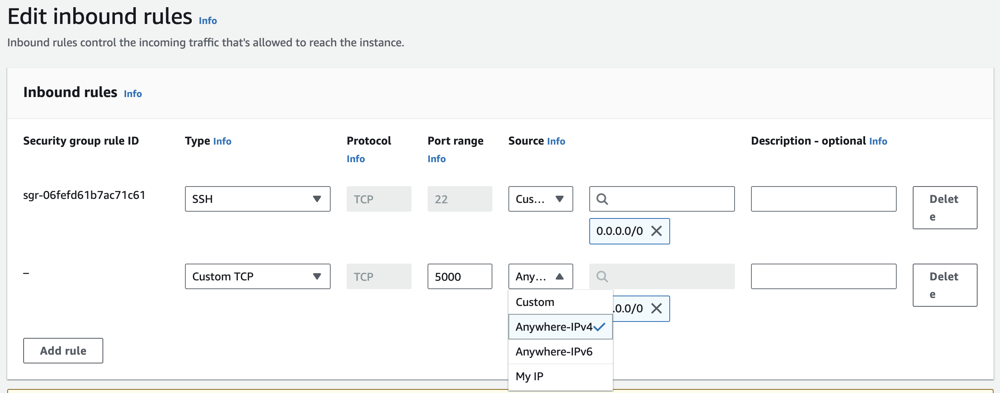
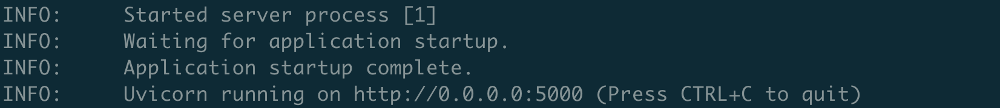

# Launching Docker Hub `pykoi` Image
You can also launch a `pykoi` image that has been released by `CambioML` on [Docker Hub](https://hub.docker.com/u/cambioml).

## Running Docker on EC2 Instance
For best performance, it is recommended to run the `pykoi` Docker images on a GPU instance on EC2.

### EC2 Setup
To run a `pykoi` Docker container, launch a GPU instance with the following config:
- EC2 `g5.2xlarge` (if you want to run a pretrained LLM with 7B parameters)
- Deep Learning AMI PyTorch GPU 2.0.1 (Ubuntu 20.04)
  
- EBS: at least 100G
  
  

### Installing Docker on your EC2
1. First, in your EC2 terminal apply any updates:
```
sudo apt update
```

2. Search for the Docker package:
```
sudo apt search docker
```
3. Get the version information
```
sudo apt info docker
```
4. Install docker by running the following:
```
sudo apt install docker
```
5. Add group membership for the default ubuntu so you can run all docker commands without using the sudo command:
```
sudo usermod -a -G docker ubuntu
id ubuntu
# Reload a Linux user's group assignments to docker w/o logout
newgrp docker
```
6. Enable docker service at AMI boot time:
```
sudo systemctl enable docker.service
```
7. Start the Docker service:
```
sudo systemctl start docker.service
```
#### Verifying Docker Installation
Verify the `Docker` installation by the checking the `docker` service status:
```
sudo systemctl status docker.service
```

Next, you can check the version:
```
docker version
```

Finally, you can run the `Docker` hello-world image:
```
docker run hello-world
```

If the installation is successful, you will see a message indicating that Docker is working correctly.

### Custom Security for Port 5000
In order to launch the running `pykoi` container in your browser, you must add a new rule to your `EC2` instance's security group for port 5000.

First, go to the __Security__ tab, and click on the __security group__.


Then from the __Inbound rules__ tab, select the __Edit inbound rules__ button.


Next, click on the __Add rule__ button.



Fill out the rule as shown here:



Finally save the rule. This may take a bit to take effect, but once this is working and your `pykoi` Docker instance is running, you should be able to acces it at the Public IPv4 DNS at port 5000.
```
http://ec2-XX-XXX-XX-XXX.YOUR-REGION.compute.amazonaws.com:5000
```

## Pulling and Running a Docker Container
### Pulling the Docker Repo
To pull a Docker Container, first locate the repository on the [CambioML Docker Hub](https://hub.docker.com/u/cambioml).

Then, you can pull the instance by repo by running the following command:
```
docker pull [REPO_NAME]
```

This will just pull the latest repository.

If you want to specify a version, just add a `:[TAG]` to the end.

```
docker pull [REPO_NAME]:[TAG]
```

For example, to pull the latest `cambioml/pykoi` repository, you can run this command:
```
docker pull cambioml/pykoi
```

### Running the Docker Image
To run the Docker image, you can use the following command, with different options depending on which repository you are running.

```
docker run -d -e [ENV_VAR_NAME]=[ENV_VAR_VALUE] -p 5000:5000 --gpus [NUM_GPUS]--name [CUSTOM_CONTAINER_NAME] [DOCKER_REPO_NAME]:[TAG]
```
- `-d`: specifies to run the container in the background
- `-e`: specifies any environment variables to use
- `-p`: specifies the port binding. Default `CambioML` is to use port 5000
- `--gpus`: specifies the number of GPUs to use.
- `--name`: A custom name for your container. If you don't specify, Docker will randomly generate one. It's best to create one so it's easy to remember to use for commands.

For example, here is a command to run `cambioml\pykoi` version `0.1_ec2_linux`.
```
docker run -d -e RETRIEVAL_MODEL=mistralai/Mistral-7B-v0.1 -p 5000:5000 --gpus all --name pykoi_test cambioml/pykoi:0.1_ec2_linux
```

***Note: this command may take a few minutes*** since it's loading a LLM.

If you are running it in the background, with a `-d` tag, you can check the logs using the following command:
```
docker logs [CONTAINER_NAME]
```
e.g. if my container is called `pykoi_test`, I would run this command:
```
docker logs pykoi_test
```

A container may take some time to build. Once it's done, you should see the following output:


Now you can go to port 5000 to interact with the `pykoi` app!

### Stopping a Container
To stop a container, run the following command.
```
docker stop [CONTAINER_NAME]
```

### Deleting a Container
To delete a container, run the following command.
```
docker rm [CONTAINER_NAME]
```

# Building Custom Docker Images
In this folder, we create the different dockerfiles for using pykoi.

1. `pykoi-cpu`: The base image for the cpu-based usage.
2. `pykoi-cpu-custom`: When you run this docker image, try to modify the `app.py` and mount it when running the docker container.

To run a docker container, we can use the following command:
```bash
docker run -dp 5000:5000 -v $(pwd)/app.py:/app/app.py \
        --name alex_test \
        pykoi/pykoi-cpu:app
```

Note that we need to keep the exposed port as 5000 (default value) to make the server work.