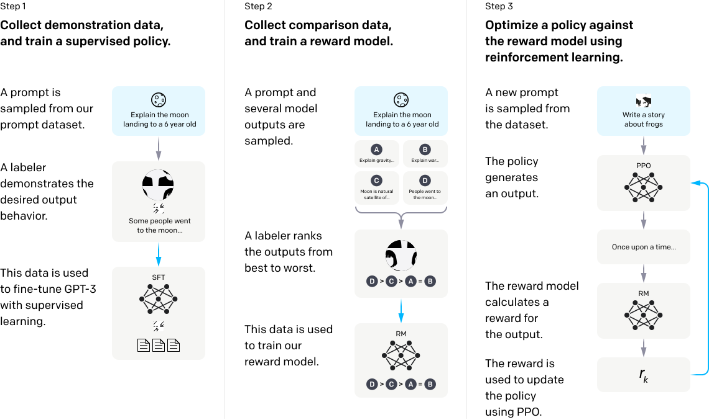

Reinforcement Learning with Human Feedback
==========================================

Reinforcement Learning with Human Feedback (RLHF) is a unique training paradigm that blends reinforcement learning and human-in-the-loop training. The central idea is to use humans' evaluative feedback to refine a model's decision-making ability and guide the learning process towards desired outcomes. Researchers from `Deepmind <https://www.deepmind.com/blog/learning-through-human-feedback>`_, `OpenAI <https://openai.com/research/learning-from-human-preferences>`_ and `Meta Llama2 <https://arxiv.org/pdf/2307.09288.pdf>`_ all show RLHF is the game changer for large language models (LLMs) training.

The following figure shows the model training pipeline of RLHF.

.. [#f1] source: OpenAI.

RLHF contains three steps: 

- Step 1: Supervised Finetuning: gather a dataset of human-generated responses. This dataset is then used to train our baseline models using supervised learning. 
- Step 2: Reward Finetuning: assemble another dataset featuring human-labelled comparisons between multiple outputs from the model on different prompts. Then, a reward model (RM) is trained on this dataset to classify the output preferred by our labelers.
- Step 3: Reinforcement Learning: use this RM as a reward function and fine-tune our GPT-3 policy to optimize this reward using RL algorithms such as the Proximal Policy Optimization (PPO) algorithm or the Direct Preference Optimization (DPO) algorithm. 

pykoi allows you to easily finetune your model on the datasets you collected via :doc:`data_collection_feedback.rst` and :doc:`data_collection_comparison.rst`.

Step 1: Supervised Finetuning
^^^^^^^^^^^^^^^^^^^^^^^^^^^^^

In this step, we use the dataset collected via :doc:`data_collection_feedback.rst` to train a baseline model using supervised learning. First, we import pykoi and load data from the local database.

.. code:: python

   import pykoi

   # get data from local database
   qa_database = pykoi.QuestionAnswerDatabase()
   my_data_pd = qa_database.retrieve_all_question_answers_as_pandas()

   # analyze the data
   print(my_data_pd)
   print("My local database has {} samples in total".format(my_data_pd.shape[0]))

Then, we can use the data to train a baseline model using supervised learning.

.. code:: python

   # run supervised finetuning
   config = pykoi.RLHFConfig(base_model_path="meta-llama/Llama-2-7b-hf", 
                             dataset_type="local_db")
   rlhf_step1_sft = pykoi.SupervisedFinetuning(config)
   rlhf_step1_sft.train_and_save("./models/rlhf_step1_sft")

Step 2: Reward Finetuning
^^^^^^^^^^^^^^^^^^^^^^^^^

After we trained a baseline model, we can use the dataset collected via :doc:`data_collection_comparison.rst` to train a reward model (RM) using supervised learning. First, we import pykoi and load data from the local database.

.. code:: python

   import pykoi

   # get data from local database
   ranking_database = pykoi.RankingDatabase()
   my_data_pd = ranking_database.retrieve_all_question_answers_as_pandas()

   # analyze the data
   print(my_data_pd)
   print("My local database has {} samples in total".format(my_data_pd.shape[0]))

Then, we can use the data to train a reward model (RM) using supervised learning.

.. code:: python

   # run reward model finetuning
   config = pykoi.RLHFConfig()
   rlhf_step2_rft = pykoi.RewardFinetuning(config)
   rlhf_step2_rft.train_and_save("./models/rlhf_step2_rw")

Step 3: Reinforcement Learning
^^^^^^^^^^^^^^^^^^^^^^^^^^^^^^

After we trained a reward model (RM), we can use the RM as a reward function and fine-tune our GPT-3 policy to optimize this reward using RL algorithms such as the Proximal Policy Optimization (PPO) algorithm or the Direct Preference Optimization (DPO) algorithm. First, we import pykoi and define the config.

.. code:: python

   import pykoi

   # use huggingface sft and reward model
   config = pykoi.RLHFConfig(
      base_model_path="meta-llama/Llama-2-7b-hf",
      reward_model_path="goldmermaid/rlhf_reward_model",
      dataset_type="huggingface", 
      dataset_name="goldmermaid/stack_exchange_rank_10k_dataset",
      dataset_subset_rl="data",
   )

Then, we can use the config to train a policy using RL.

.. code:: python

   rlhf_step3_rl = pykoi.RLFinetuning(config)
   rlhf_step3_rl.train_and_save("./models/rlhf_step3_rl")

.. note::

   This project is under active development.
